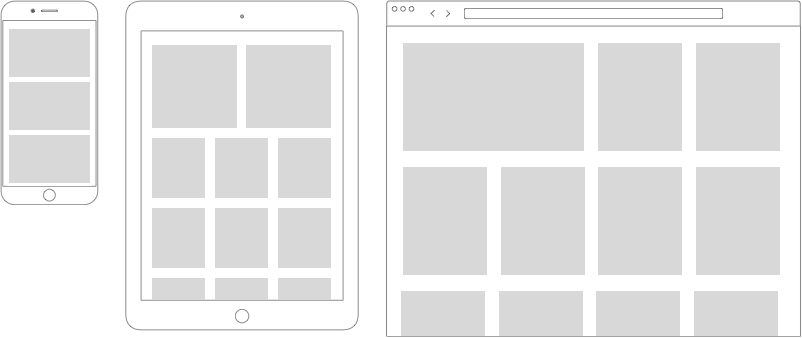

## Homework HTML/CSS/GIT Week 2

> Create a directory "week2" inside your `HYF-Module-HTMLCSSGIT` directory on GitHub. There should already be a "week1" folder that contains your homework from the last week.

## Todo list

1. GIT exercises
2. Responsive design challenges
3. Code along
4. PROJECT: Responsive website

### 1. GIT exercises

> Before you start any of the exercises, make sure to create a folder on your desktop that will hold all of your exercise files. Go inside the `hyf-html-exercises` folder. Inside, create a `week2` folder that will hold this week's exercise files inside.

### Exercise 1:

1.   Create a repository on Github called favorite-cmd-commands, make sure to check the checkmark about including a README file
2.   Clone that repository (Google how to clone a repository).
3.   Create a file `YOUR_NAME-commands.txt`.
4.   Add bash commands that you like (at least 3). Provide a short description (20 characters~) for each.
5.   Then `git add`, `git commit` and `git push` the file to your GitHub repository.

### 2. Responsive design challenges

Making websites that are `responsive` to a variety of device sizes (in other words, that still "look good" on any device), has become the standard way of building websites. You have to learn how to do this too. It's not as intimating as it might seem; you're **not** going to build a separate page for literally every device size out there.

Instead, you'll be applying certain CSS rules only to certain device sizes: the average desktop (1024px and more), the average tablet (between 600px and 1024px) and the average mobile device (600px and below).

In the following mini-course you'll get some practice in doing this:

-   [Responsive Web Design Challenges](https://learn.freecodecamp.org/responsive-web-design/responsive-web-design-principles/)

### 3. Code along

In the following video you'll be rebuilding a responsive HTML5 website. Put your focus on how the structure of the page is built: First HTML to provide structure & content, and then the CSS. Look at the HTML tags used and the names given to classes.

-   [Build A Responsive Website With HTML & CSS Tutorial](https://www.youtube.com/watch?v=ZeDP-rzOnAA)

### 4. PROJECT: Drones website

> Use GIT and GitHub while making this project, you can easily use this as part of your portfolio!

In this project you'll be building on an existing project. It's your job to make it `responsive` and look organised on various devices.

Start off by downloading the HTML and images in the following [folder](https://github.com/HackYourFuture/HTML-CSS/tree/master/Week2/homework).

You are going to write the CSS for this page, **it is not allowed to change the HTML**.

The page contains two grids: the first one should work using `floats`, the second using `flexbox`. Be careful not to mix the two! And make sure not to use grid anywhere.

Other than that you should use `media queries`. Here are the requirements for each device size:

-   On mobile phones (smaller than 600px): a one column grid, that spans the full width
-   On tablets (between 600px and 1024px): a three column grid, with the exception that the first two items span the full width together (so first we have two columns, then after the first two items we have three columns)
-   On desktops (1024px and up): a four column grid, with the exception that the first item spans two columns. - There should be some `margin` between the grid items

So that it works like this:

Make the page look beautiful by adding some more CSS! Include CSS rules for:

-   `hover` states for the grid elements, to indicate to the user that they're looking at that specific drone
-   A distinct `font-family`, found from [Google Fonts](https://fonts.google.com/). Include using the `font-face` [rule](https://css-tricks.com/snippets/css/using-font-face/)
-   Animation using `transition`

## SUBMIT YOUR HOMEWORK!

After you've finished your todo list it's time to show us what you got! The homework you have to submit this week is the following:

1. GIT exercise #1 (the URL of the remote `git_practice` repository)
2. The Drones website

Go through the [guide](../hand-in-homework-guide.md) to learn how to submit your homework.
